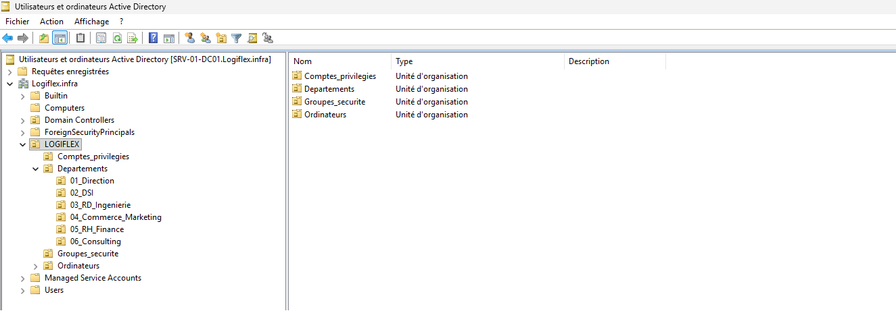
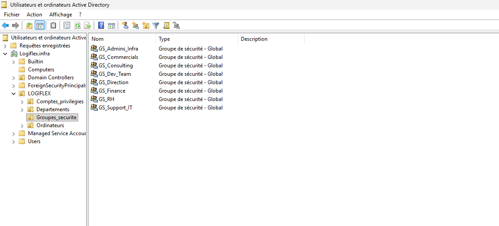

# 🏢 Contexte d'Entreprise & Organisation — LOGIFLEX
<br>

## 1. Présentation de l'Entreprise
**LOGIFLEX Solutions** est un éditeur de logiciels international spécialisé dans l'optimisation de la chaîne logistique (*Supply Chain Management*) et l'automatisation d'entrepôts intelligents (*WMS / TMS*). L'entreprise conçoit, déploie et supervise des solutions cloud et sur site pour des acteurs industriels mondiaux.

Dans le cadre d'un plan de modernisation et de durcissement de son Système d'Information, **LOGIFLEX** standardise son infrastructure autour d'un domaine **Active Directory (AD DS)** centralisé afin d'unifier l'authentification, d'appliquer une politique de sécurité stricte (*Zero Trust / Least Privilege*) et de faciliter l'administration multi-serveurs.

---
<br>

## 2. Répartition des Effectifs & Départements (Total : 45 Collaborateurs)
L'entreprise compte **45 employés** répartis sur **6 pôles métiers**. Pour la maquette d'infrastructure, un échantillon représentatif de **12 comptes utilisateurs** est provisionné dans l'annuaire :

| Département / Pôle | Rôle & Missions | Effectif Réel | Comptes Démo (AD) |
| :--- | :--- | :---: | :---: |
| **Direction Générale (Management)** | Pilotage stratégique, affaires juridiques et conformité. | **4** | 2 |
| **Direction des Systèmes d'Information (DSI)** | Administration des infrastructures, cybersécurité, support N1/N2/N3. | **6** | 3 |
| **R&D & Ingénierie Logicielle** | Développement d'applications, architectures Cloud, DevOps et QA. | **15** | 2 |
| **Commerce & Marketing International** | Développement commercial, marketing produit et gestion des partenariats. | **10** | 2 |
| **Ressources Humaines & Finance** | Gestion des talents, comptabilité générale et contrôle financier. | **5** | 2 |
| **Consulting & Intégration Client** | Déploiement chez les clients, formation et gestion de projets sur site. | **5** | 1 |
| **TOTAL** | — | **45** | **12** |

---

<br>

## 3. Répertoire des Utilisateurs (Jeu de Données Active Directory)
Afin de refléter la dimension internationale de l'entreprise, les collaborateurs sont issus d'horizons variés :

| Collaborateur | Identifiant (`sAMAccountName`) | Service / Département | Poste & Responsabilités | Groupe AD Principal |
| :--- | :--- | :--- | :--- | :--- |
| **Elena ROSTOVA** | `erostova` | Direction Générale | Chief Executive Officer (CEO) | `GS_Direction` |
| **Liam O'CONNOR** | `loconnor` | Direction Générale | Legal & Compliance Officer | `GS_Direction` |
| **Marcus VANCE** | `mvance` | Systèmes d'Information (DSI) | Responsable Sécurité & Infra (RSSI) | `GS_Admins_Infra` |
| **Amina AL-MANSOOR** | `aalmansoor` | Systèmes d'Information (DSI) | Ingénieure Systèmes & Réseaux | `GS_Admins_Infra` |
| **Kenji TANAKA** | `ktanaka` | Systèmes d'Information (DSI) | Technicien Support & Postes | `GS_Support_IT` |
| **Mateo SILVA** | `msilva` | R&D & Ingénierie | Lead Développeur Backend | `GS_Dev_Team` |
| **Sven LINDQVIST** | `slindqvist` | R&D & Ingénierie | Ingénieur Cloud & DevOps | `GS_Dev_Team` |
| **Sarah JENKINS** | `sjenkins` | Commerce & Marketing | VP Global Sales & Partnerships | `GS_Commercials` |
| **Carlos MENDEZ** | `cmendez` | Commerce & Marketing | Lead Product Marketing | `GS_Commercials` |
| **Fatou DIOP** | `fdiop` | RH & Finance | Directrice des Ressources Humaines | `GS_RH` |
| **Lukas WEBER** | `lweber` | RH & Finance | Contrôleur Financier & Comptable | `GS_Finance` |
| **Priya PATEL** | `ppatel` | Consulting & Intégration | Consultante Déploiement WMS | `GS_Consulting` |

---

<br>

## 4. Architecture Logique Active Directory
L'annuaire est structuré pour séparer distinctement les entités organisationnelles (utilisateurs, services) des composants techniques (serveurs, postes, groupes) :

```text
DC=logiflex,DC=infra
└── OU=LOGIFLEX (OU Racine d'entreprise)
    ├── OU=Departements (Contient les comptes utilisateurs selon le métier pour ciblage GPO)
    │   ├── OU=01_Direction
    │   ├── OU=02_DSI
    │   ├── OU=03_RD_Ingenierie
    │   ├── OU=04_Commerce_Marketing
    │   ├── OU=05_RH_Finance
    │   └── OU=06_Consulting
    ├── OU=Ordinateurs (Contient tous les postes et serveurs gérés)
    │   ├── OU=Serveurs        --> Contiendra SRV-01-DC01 et SRV-02-MGMT
    │   └── OU=Postes_Clients  --> Contiendra les futures machines clientes Windows 10/11
    ├── OU=Groupes_Securite    --> Contiendra tous les groupes GS_* (droits d'accès et partages)
    └── OU=Comptes_Privilegies --> Contiendra les comptes d'administration de domaine (Tier 0 / Tier 1)
```
<br>

### 📸 Vue de l'implémentation

<br>



* **`OU=LOGIFLEX` (Racine)** : Conteneur principal isolant l'ensemble des objets de l'organisation des conteneurs par défaut de Windows.
* **`OU=Departements`** : Structure hiérarchique regroupant les utilisateurs par pôle métier (`01_Direction` à `06_Consulting`) afin de permettre un ciblage précis des stratégies de groupe (GPO).
* **`OU=Ordinateurs`** : Séparation logique stricte entre les serveurs d'infrastructure (`OU=Serveurs`) et les machines clientes (`OU=Postes_Clients`).
* **`OU=Groupes_securite`** : Centralisation des groupes globaux de sécurité (`GS_*`) pour la gestion granulaire des droits d'accès NTFS et des partages.
* **`OU=Comptes_privileges`** : Zone dédiée aux comptes d'administration à hauts privilèges (respect du modèle de moindre privilège et préparation au *Tiering Model*).
---

<br>


